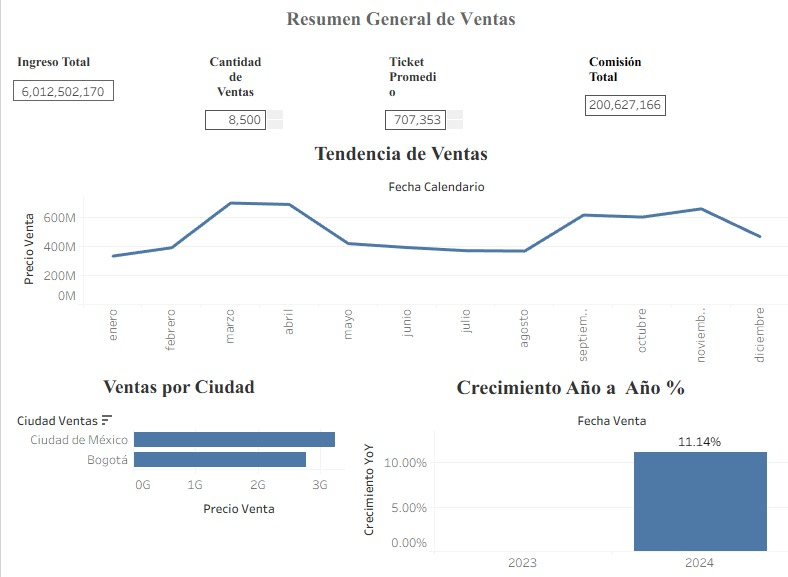
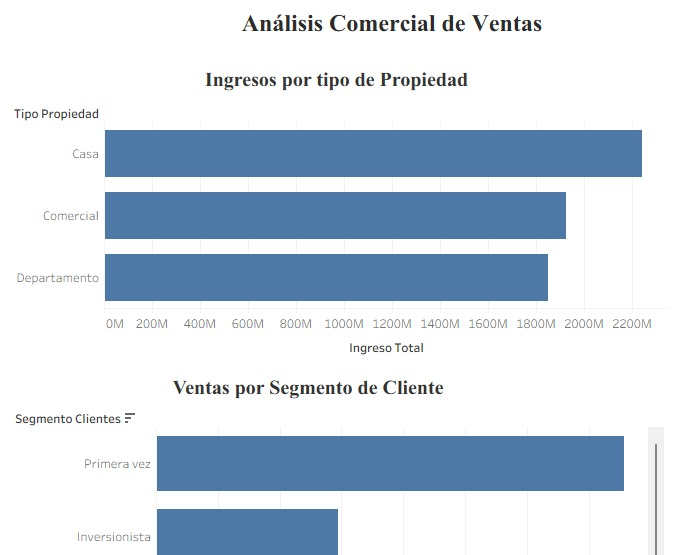
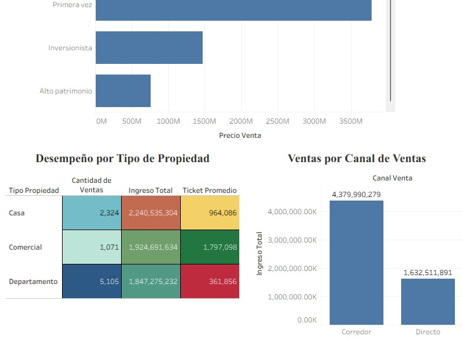
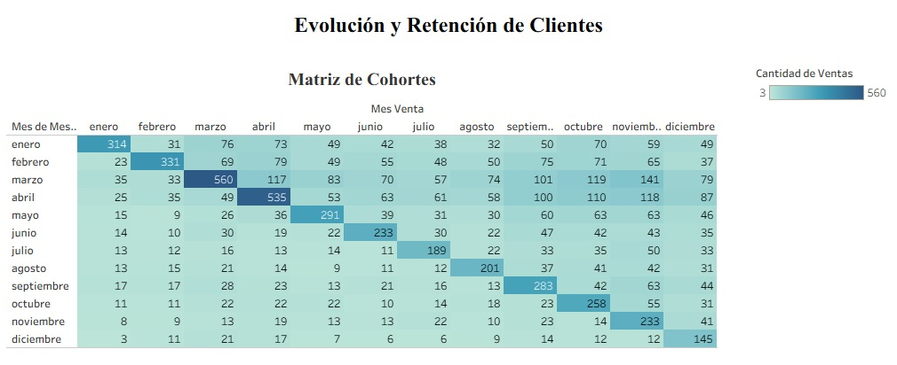

# Mercado Inmobiliario – Análisis de Ventas, Clientes y Retención
Análisis de datos del mercado inmobiliario enfocado en evaluar el desempeño de las ventas, los ingresos, el comportamiento de los clientes y la retención mediante dashboards interactivos en Tableau.

## Pregunta de negocio
¿Cómo se comportan las ventas y los ingresos del mercado inmobiliario, y qué características de los clientes y las propiedades pueden ayudar a identificar oportunidades comerciales?

## Objetivo
- Analizar el desempeño de las ventas e ingresos.
- Identificar las ciudades, tipos de propiedad, segmentos y canales con mayor participación.
- Analizar la evolución de las ventas durante el periodo estudiado.
- Evaluar el comportamiento y recurrencia de los clientes mediante análisis de cohortes.
- Presentar los resultados mediante dashboards interactivos en Tableau.

## Datos
El análisis utiliza información de **8,500 ventas inmobiliarias**, considerando variables relacionadas con:
- Fecha de venta.
- Ciudad.
- Tipo de propiedad.
- Segmento de cliente.
- Canal de venta.
- Clientes y recurrencia.
- Ingresos y comisiones.

## Metodología
- Revisión y organización de la información disponible.
- Análisis de ventas e ingresos.
- Cálculo de indicadores comerciales.
- Comparación del desempeño por ciudad, tipo de propiedad, segmento y canal.
- Análisis de la evolución de las ventas.
- Análisis de cohortes para evaluar la recurrencia de clientes.
- Construcción de dashboards interactivos en Tableau.

## Herramientas
- Tableau

## Dashboards
### Ejecutivo
Vista general del desempeño comercial mediante indicadores de ingresos, ventas, ticket promedio y comisión, además de visualizaciones sobre la evolución y distribución de las ventas.

### Análisis Comercial
Permite profundizar en el desempeño comercial mediante el análisis de ingresos por tipo de propiedad, segmento, canal y otros indicadores de ventas.

### Análisis de Cohortes
Analiza la recurrencia de los clientes mediante una matriz de cohortes, permitiendo observar el comportamiento de los clientes a lo largo del tiempo.

## Principales hallazgos
- Se analizaron **8,500 ventas**, con ingresos totales de aproximadamente **$6,012.5 millones**.
- El ticket promedio fue de aproximadamente **$707,353** y las comisiones alcanzaron aproximadamente **$200.6 millones**.
- **Ciudad de México** presentó el mayor volumen de ventas.
- **Casa** fue el tipo de propiedad con mayor generación de ingresos.
- El segmento **Corredor** presentó el mayor nivel de ingresos.
- En 2024 se observó un crecimiento de **11.14%** respecto al periodo comparable.
- La cohorte de **marzo** presentó la mayor recurrencia, con **560 clientes**.
- Los clientes de primera compra representaron la mayor contribución de ingresos, mostrando una oportunidad para trabajar en su recurrencia.

## Archivos del proyecto
- Archivo de Tableau (`.twb` o `.twbx`) — proyecto y dashboards desarrollados en Tableau.
- `inmobiliario_ejecutivo.png` — captura del dashboard Ejecutivo.
- `inmobiliario_analisis_comercial_1.png` — primera parte del dashboard Análisis Comercial.
- `inmobiliario_analisis_comercial_2.png` — segunda parte del dashboard Análisis Comercial.
- `inmobiliario_cohortes.png` — captura del dashboard Análisis de Cohortes.
